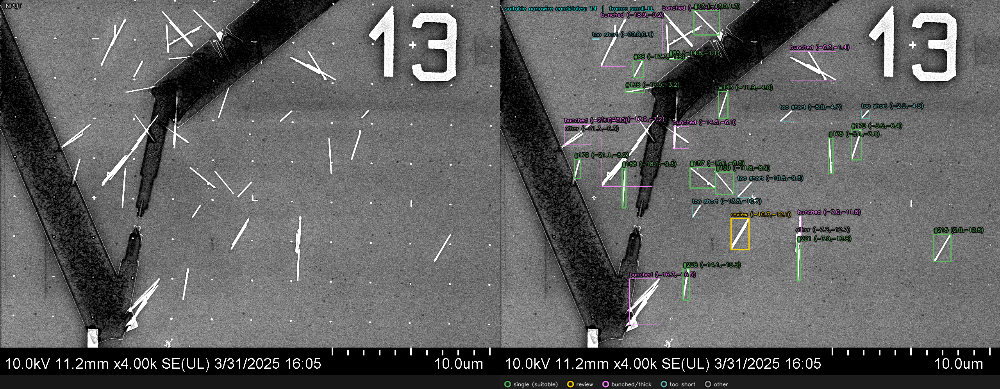
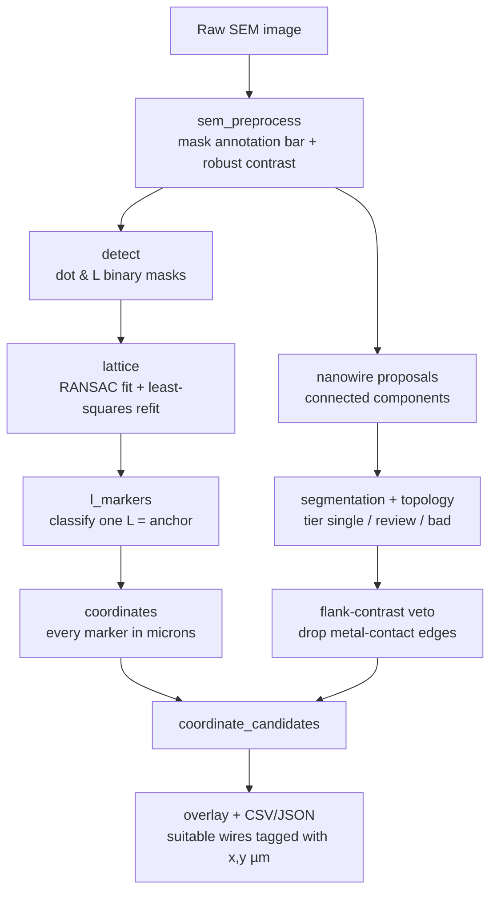

# SEM Nanowire Candidate Mapping

[](https://github.com/mumrah213/nanowire_detection/actions/workflows/tests.yml)



Detect **suitable nanowire candidates** in experimental SEM images and tag each
with its physical (µm) coordinate on the device's marker grid, so a good wire
can be located again.

The flow has two stages that are fused by `nanowire_ml/coordinate_candidates.py`:

1. **Grid coordinate frame** (`grid_pipeline/`): detect the dot
   lattice, fit + least-squares-refine it, classify one L marker, and anchor a
   physical (µm) coordinate frame for the field.
2. **Nanowire detection** (`nanowire_ml/`): propose connected components,
   describe each with segmentation/skeleton topology (and an optional CNN), and
   tier them `single` / `review` / `bad`.

The fusion maps every candidate's pixel location to µm and writes a combined
overlay + table.

> **See [`docs/WALKTHROUGH.md`](docs/WALKTHROUGH.md)** for a step-by-step tour
> with a figure and a code snippet for every stage.

## Pipeline at a glance



## Setup

Install with [uv](https://docs.astral.sh/uv/) (recommended — it also installs
the right Python and gives a reproducible environment):

```bash
git clone <repo-url> && cd nanowire_detection
uv sync                 # core pipeline (numpy + OpenCV, no torch)
```

That's all you need for the full detection + coordinate pipeline. The optional
"second-opinion" CNN is the only thing that needs torch — install it as an extra
when you want it:

```bash
uv sync --extra cnn     # adds torch for the CNN second opinion
```

Then prefix commands with `uv run` (e.g. `uv run python nanowire_ml/coordinate_candidates.py ...`),
or activate the venv with `source .venv/bin/activate`.

Prefer plain pip? Pinned core dependencies are exported to `requirements.txt`:

```bash
python3.12 -m venv .venv && source .venv/bin/activate
pip install -r requirements.txt          # core
pip install -r requirements.txt "torch>=2.0"   # + optional CNN
```

Requires Python 3.10+. The default OpenCV is the **headless** build (no display
dependency); install `opencv-python` instead if you need GUI windows
(`cv2.imshow`).

### Reproducibility — "this will work on your machine"

`pyproject.toml` declares the dependencies and `uv.lock` pins the exact version
of every direct and transitive package, so `uv sync` reproduces the same
environment everywhere. CI runs that *same* install on a clean VM across Python
3.10 and 3.12 and runs the test suite, so a green badge means a fresh checkout
installs and works — not just "works on my machine". (The lockfile pins Python
packages; it does not pin the OS or system libraries — that's Docker territory,
intentionally out of scope here.)

Inputs are SEM images under `experimental_sem/`; all outputs land under
`experimental_sem_results/` (git-ignored).

## Quick start

Combined candidate + coordinate pipeline (the headline tool):

```bash
python nanowire_ml/coordinate_candidates.py experimental_sem/13.tif \
  --output-dir experimental_sem_results/nanowire_coordinate_candidates/13
```

Writes:
- `13_candidates_overlay.png` — every candidate marked by category, suitable ones coordinate-labeled
- `13_candidates.csv/.json` — table of all candidates
- `candidates/` — per-candidate crops with µm boundaries and individual JSON files

Grid coordinate pipeline on its own:

```bash
python -m grid_pipeline.pipeline experimental_sem/13.tif \
  --no-contrast-sweep --output-dir experimental_sem_results/grid_check
# full contrast-sweep batch over experimental_sem/:
PYTHON_BIN=/home/mumrah/projects/.venv312/bin/python bash grid_pipeline/run_experimental_batch.sh
```

Nanowire pipeline on its own:

```bash
python nanowire_ml/fused_nanowire_pipeline.py experimental_sem/13.tif \
  --output-dir experimental_sem_results/nanowire_fused_13 --policy high_precision
```

## Repository map

| Path | Purpose |
| --- | --- |
| `utils/sem_preprocess.py` | Annotation-band detection, robust contrast, bright-dot binary |
| `utils/blob_utils.py` | Thresholding + anchored connected-component detection |
| `utils/grid_ransac.py` | RANSAC lattice spacing/orientation fitting |
| `grid_pipeline/pipeline.py` | Grid pipeline: dots → lattice fit/refine → L classification → µm coordinates → overlays + side panel |
| `grid_pipeline/run_experimental_batch.sh` | Contrast-sweep batch over `experimental_sem/` |
| `nanowire_ml/coordinate_candidates.py` | **Orchestrator**: fuses grid coords + nanowire tiers → coordinate-tagged candidates |
| `nanowire_ml/fused_nanowire_pipeline.py` | Blob proposals + topology + CNN fusion (`high_recall`/`high_precision`) |
| `nanowire_ml/segmentation_baseline.py` | Classical segmentation + skeleton topology + flank-contrast (metal-edge) veto |
| `nanowire_ml/topology.py` | Skeleton / topology features |
| `nanowire_ml/predict_real_components.py` | Component proposals + CNN inference helpers |
| `nanowire_ml/train_classifier.py` | Small nanowire CNN (model + preprocessing); training entry point |
| `nanowire_ml/{generate_dataset,generate_high_contrast_dataset,evaluate_classifier,visualize_alignment_steps}.py` | Optional CNN training / eval / diagnostics |
| `experimental_sem/*.tif` | Real SEM inputs |
| `experimental_sem_results/` | Generated outputs (git-ignored) |

## Coordinate frame and grid rules

- 1 lattice step = **2.5 µm**. L-marker elbows sit on the field diagonals at
  **±10 µm (small)** and **±20 µm (big)**; one classified L fixes the origin.
- The lattice is fit on confident dots, then **least-squares refit** (removes the
  edge drift a coarse RANSAC fit leaves). Pixel→µm uses `pixel_to_um`.
- Dot acceptance is **loose tolerance + outlier removal** (genuine shifted
  markers are kept; off-grid detections are removed, never snapped to).
- Extra rules: **interior-displacement** rejection (a marker pinned between
  accepted neighbors must sit at their midpoint), **big/small L scale
  consistency** (resolved by confidence with a big-L bonus), **adaptive top-hat**
  bright-dot detection, and an illustrative **predicted big-L** glyph.

## Nanowire candidate categories (combined overlay)

| Category | Meaning |
| --- | --- |
| `single` (green) | suitable isolated nanowire — coordinate-labeled |
| `review` (amber) | borderline |
| `bunched` (purple) | crossed / branched / broad nanowire mess |
| `other` (gray) | markers / electrodes / noise / blobs |

The **flank-contrast test** helps reject false positives: a real nanowire is
dark on both perpendicular sides, while a metal contact edge is bright on one
side. Candidates failing this test are rejected but not given a separate category.

## Example output

```
Suitable nanowire candidates:
-------------------------------------------------------------------------------------
   #    x (µm)    y (µm)  length (nm)   diam (nm)   conf  crop
-------------------------------------------------------------------------------------
  13    -13.03      1.18         2710          55   0.98  13_candidate_0013.png
 138    -17.49     -3.18         1035          56   0.95  13_candidate_0138.png
 143    -11.91     -3.99         1601          53   0.95  13_candidate_0143.png
 170     -3.48     -6.40         1798          66   0.94  13_candidate_0170.png
  85    -14.85     -1.10          764          61   0.94  13_candidate_0085.png
  88    -17.29     -1.81         1379          72   0.94  13_candidate_0088.png
 215      2.03    -12.82         2192          56   0.94  13_candidate_0215.png
 226    -14.10    -15.35         2833          64   0.93  13_candidate_0226.png
 179    -21.05     -8.16          936          54   0.93  13_candidate_0179.png
 190    -11.74     -8.93         2143          37   0.93  13_candidate_0190.png
 187    -13.14     -8.60         2389          75   0.92  13_candidate_0187.png
 175     -5.08     -7.11         3596          63   0.92  13_candidate_0175.png
 188    -18.09     -9.32         2463          59   0.91  13_candidate_0188.png
 221     -7.02    -13.83         2931          88   0.89  13_candidate_0221.png
-------------------------------------------------------------------------------------
```

Each candidate includes physical coordinates (µm), estimated length and diameter
(nm), and a confidence score. Per-candidate crops and JSON files with full
coordinate boundaries are written to `candidates/`.

## Notes

- The nanowire CNN is **inert unless a checkpoint exists** at the path in
  `fused_nanowire_pipeline.py::DEFAULT_CHECKPOINT`; without it, tiering is
  topology-driven. Use the `generate_*`/`train_classifier`/`evaluate_classifier`
  scripts to (re)train.
- Outputs under `experimental_sem_results/` are regenerable and git-ignored.
