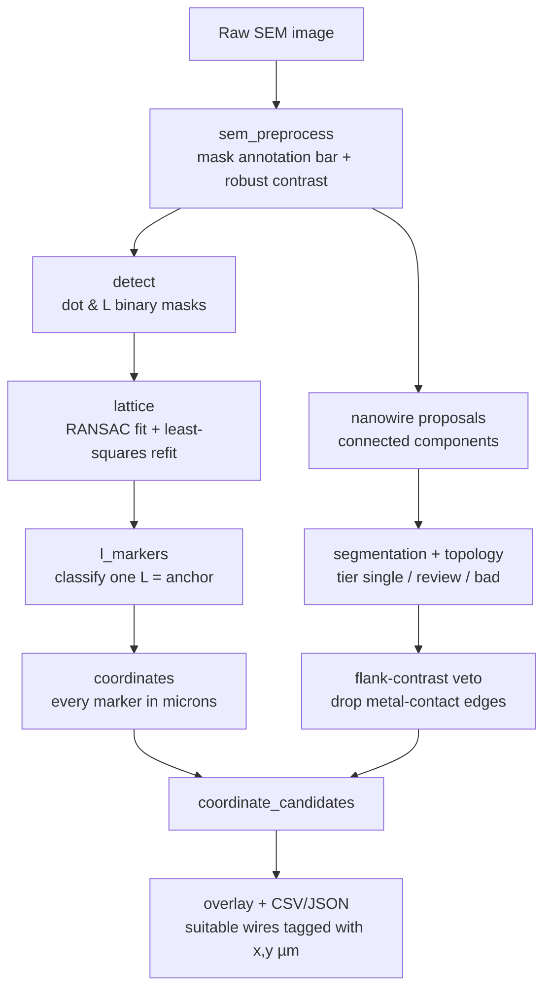
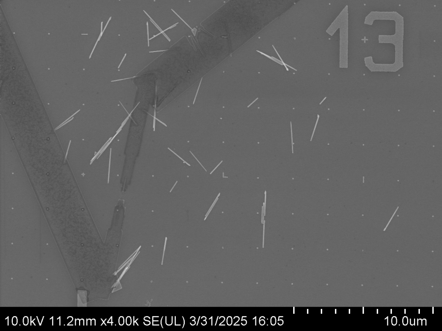
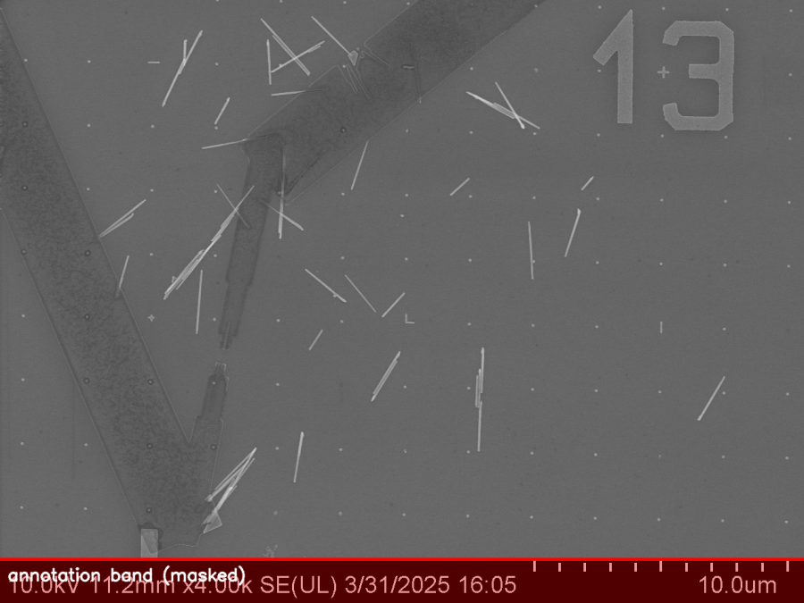
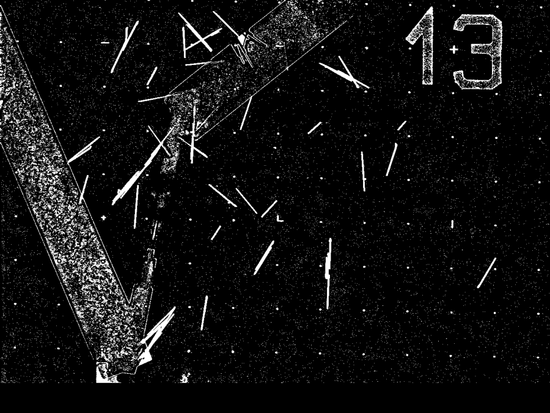
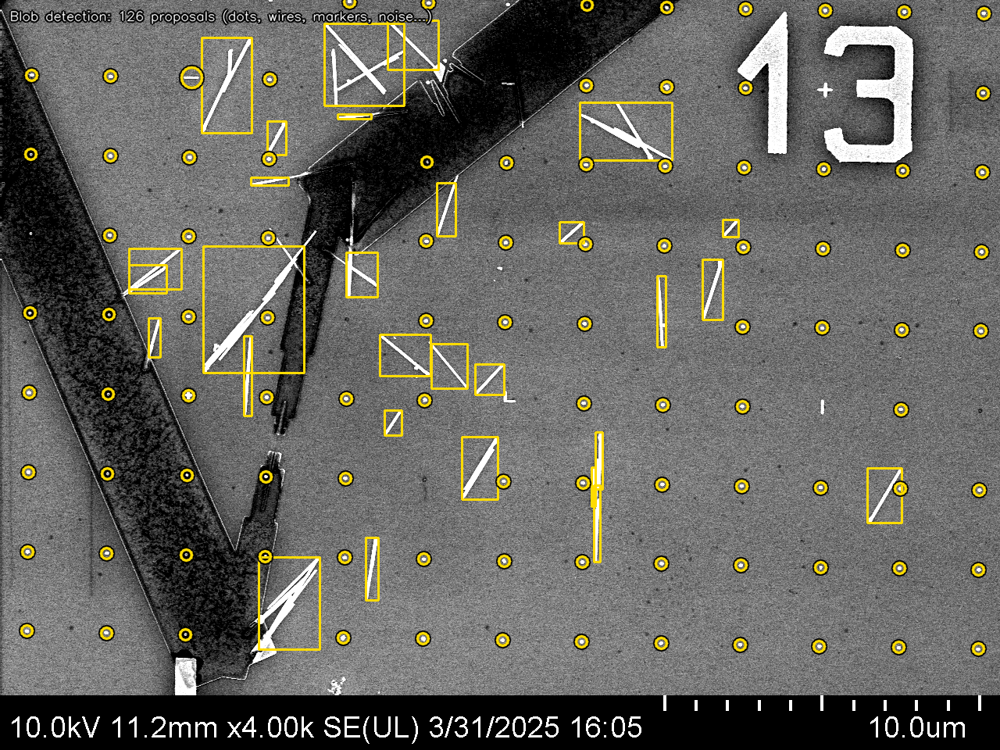
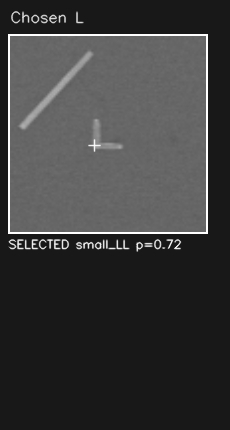
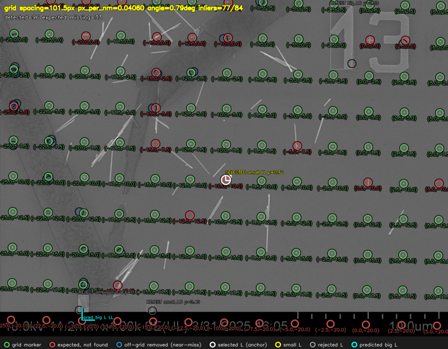
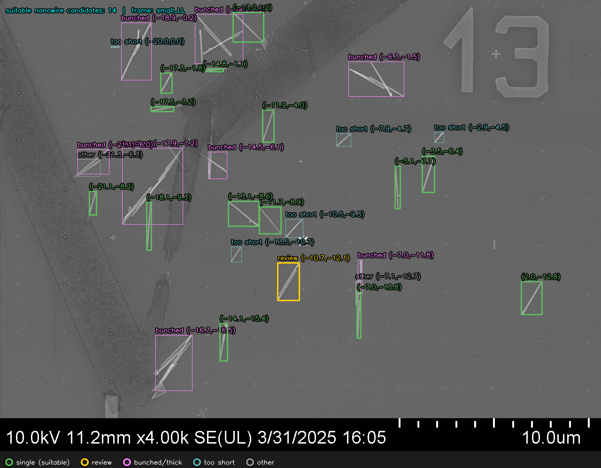
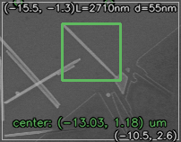

# Pipeline walkthrough

A step-by-step tour of how one raw SEM image becomes a set of nanowire
candidates labelled with physical (µm) coordinates. Every step shows the figure
it produces and the few lines of code that decide it. (All images here are
image `13.tif`.)



---

## 0. Input

A raw secondary-electron SEM image: a faint dot grid (fiducial markers), a few
L-shaped markers, some nanowires, and bright metal contacts — plus the
instrument's annotation bar along the bottom.



---

## 1. Remove the annotation bar, normalise contrast

The bottom bar has wildly different statistics from the image field (high row
variance, saturated pixels). We scan rows from the bottom up and cut at the
first sustained return to image-like statistics. Thresholds use a **robust**
median + MAD-sigma so a bright contact can't skew them.

```python
# utils/sem_preprocess.py
std_threshold = max(ref_std * 3.0, ref_std + 15.0)
suspicious = (row_std > std_threshold) | (row_bright > ...) | (row_dark > ...)
#  ...walk up from the bottom until image-like rows resume -> cutoff_y

mad = np.median(np.abs(pixels - median))
robust_sigma = 1.4826 * mad                       # outlier-resistant spread
threshold = max(percentiles["p99"], median + 5.0 * robust_sigma)
```

Everything below `cutoff_y` (red) is excluded from all downstream steps.



---

## 2. Detect the dots

Markers are small bright blobs. A single global threshold misses faint dots on
the dim side of an illumination gradient, so we **flatten the illumination with
a white top-hat** (subtract a morphological-opening background estimate) and
threshold relative to the robust sigma. Junk this admits is pruned later by the
lattice.

```python
# grid_pipeline/detect.py  (adaptive_bright_binary)
opened = cv2.morphologyEx(gray, cv2.MORPH_OPEN, disk)   # local background
tophat = cv2.subtract(gray, opened)                     # dots pop, gradient gone
binary[(tophat > k * robust_sigma) & valid] = 255
```



---

## 2b. Blob detection proposes everything

At this stage, blob detection is intentionally permissive — it proposes every
bright connected component: grid dots, nanowires, L markers, the "13" field
number, noise, even edges of metal contacts. Later stages filter and classify.



---

## 3. Fit the grid (RANSAC + least-squares refit)

We do **not** use an FFT in the end — the grid is found by RANSAC lattice
fitting (largest set of dots consistent with one spacing + orientation), then a
least-squares refit that removes the few-pixel drift a coarse fit leaves at the
frame edges (this is what stopped edge markers from being "lost").

```python
# grid_pipeline/lattice.py
lattice = ransac_2d_grid_fitting(positions, spacings, ...)   # coarse spacing+angle
# refit to the accepted dots:  x = a*i - b*j + tx ,  y = b*i + a*j + ty
#   spacing = hypot(a, b) ,  angle = atan2(b, a)
```

A detection near a node (loose tolerance) is kept even if slightly shifted — the
shift is real signal. A detection far from every node is removed as dirt; we
never snap it onto the grid.

---

## 4. Anchor the coordinate frame with one L marker

One classified L marker fixes the absolute origin: its orientation (UL/UR/LR/LL,
from an edge-fill + template score) gives the sign, its size (small=10 µm,
big=20 µm) gives the magnitude. From that anchor, every lattice node — and any
pixel — converts to microns.

```python
# grid_pipeline/lattice.py  (pixel_to_um)
di = (dx * cos_a + dy * sin_a) / spacing             # fractional steps along grid
ux = (sel_anchor_nm[0] + di * pitch_nm) / 1000.0     # -> microns, anchored on the L
```

The chosen L (left) and the full grid labelled in µm — green = detected,
red = expected-but-missing (right):

<p>


</p>

---

## 5. Detect nanowire candidates, tag them with coordinates

Each connected component is scored by interpretable topology (aspect, width,
skeleton branches, straightness) into **single / review / bad**.

### Nanowire vs metal contact edge

One tricky case: the bright edges of metal contacts look similar to nanowires.
The **flank contrast test** distinguishes them: a real nanowire is dark on
*both* perpendicular sides, while a contact edge has bright metal on one side.

```python
# nanowire_ml/segmentation_baseline.py  (flank_contrast_features)
# share of the wire's contrast reproduced by the BRIGHTER flank:
edge_like = (brighter_flank - darker_flank) / (wire - darker_flank)   # ~0 wire, ~1 edge
if edge_like > 0.50:
    reject("contact_edge")
```

The orchestrator (`coordinate_candidates.py`) then maps every candidate's
position to microns and renders one figure: each candidate categorised
(single / review / metal / bunched / …) with µm coordinates on the suitable ones.



---

## 6. Per-candidate crops with µm boundaries

Each suitable candidate gets its own zoomed crop showing the nanowire with ~2
grid cells of context. The crop includes:

- The nanowire bounding box (green)
- Nearby dot markers (green circles)
- µm coordinates at corners and center

<p>

</p>

Each candidate also gets a JSON file with precise coordinate boundaries:

```json
{
  "component": 85,
  "center_um": [-14.846, -1.101],
  "bounds_um": {
    "x_min": -20.402, "x_max": -9.272,
    "y_min": -6.074,  "y_max": 2.493
  },
  "crop_file": "13_candidate_0085.png"
}
```

---

## Output

For each image:

- `<stem>_candidates_overlay.png` — full field with all candidates marked
- `<stem>_candidates.csv` / `.json` — table of all candidates with coordinates
- `candidates/` — per-candidate crops and JSON files with µm boundaries
